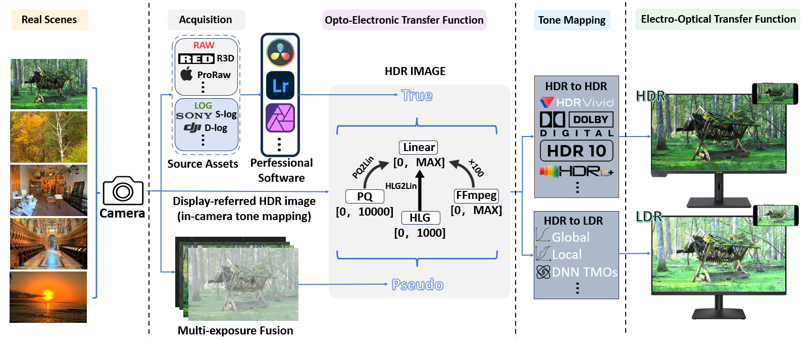
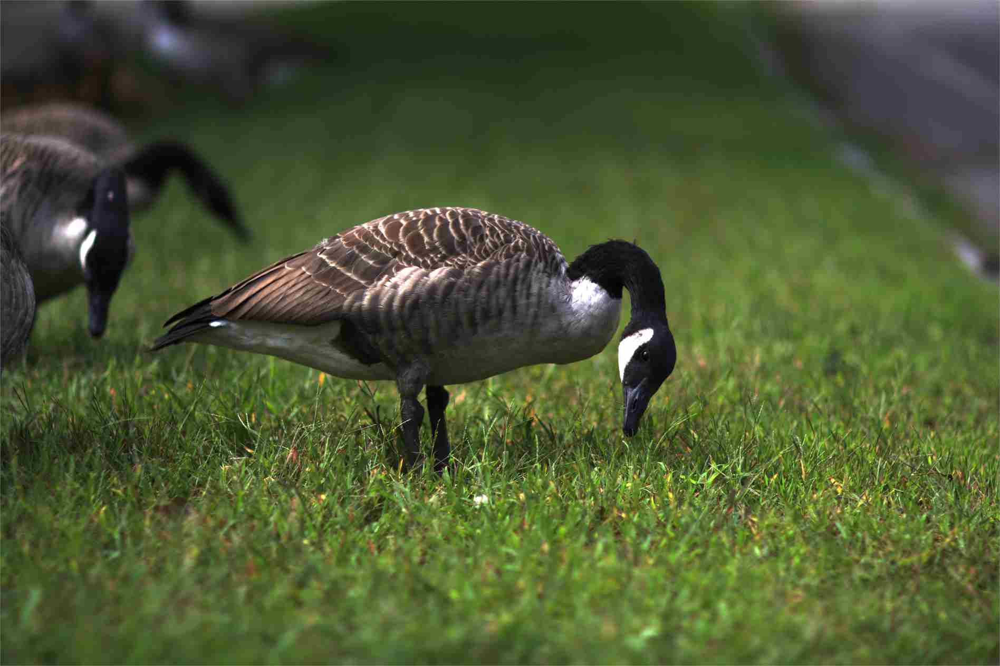
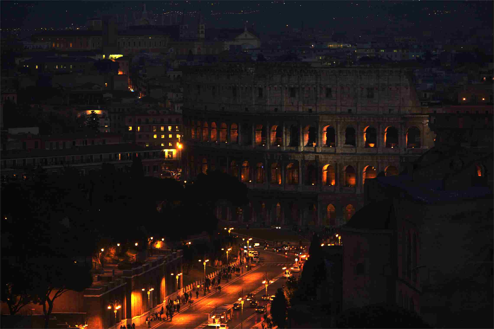
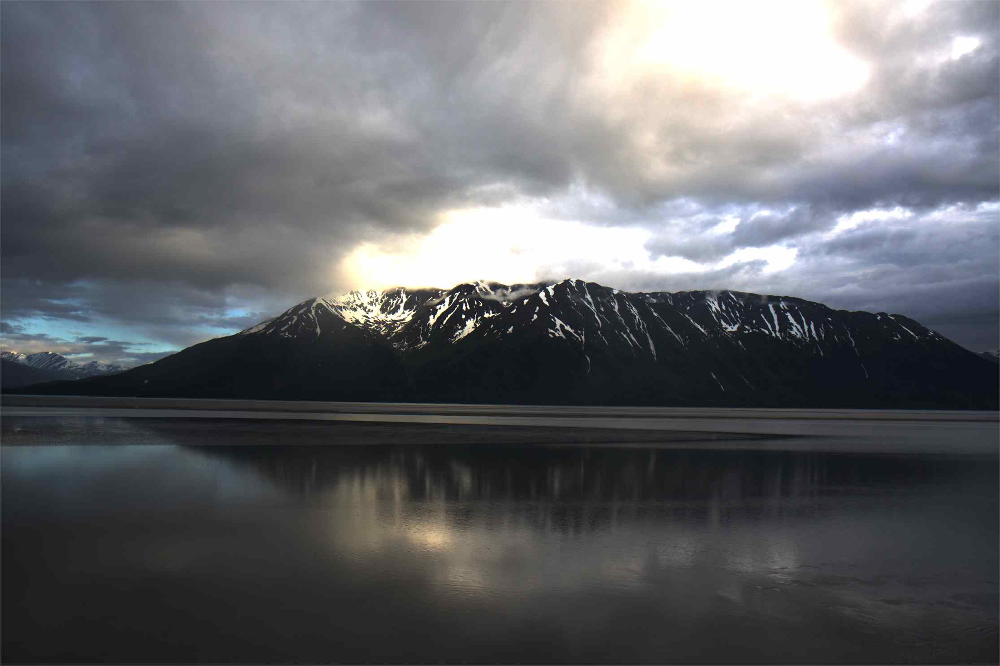
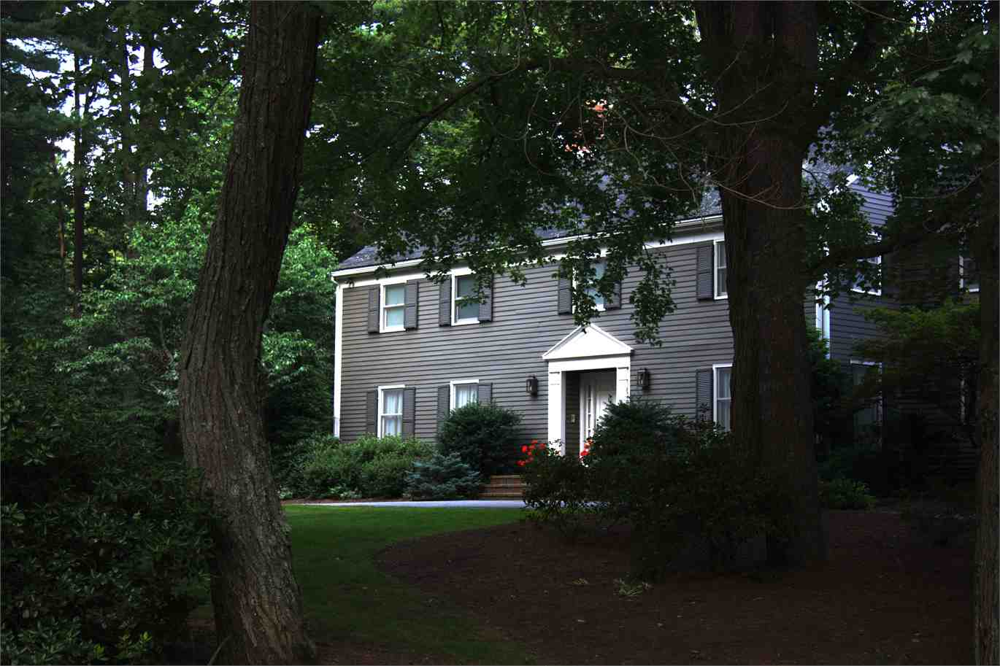
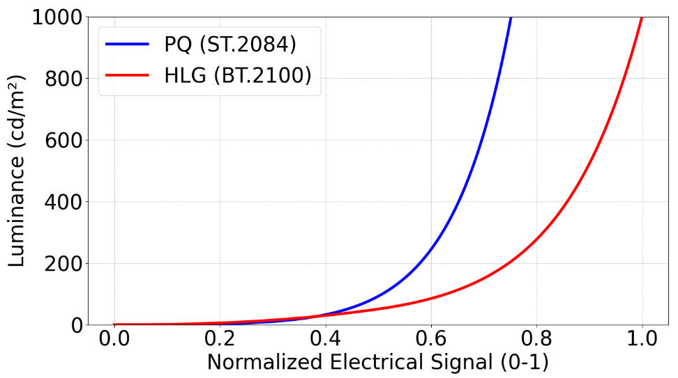
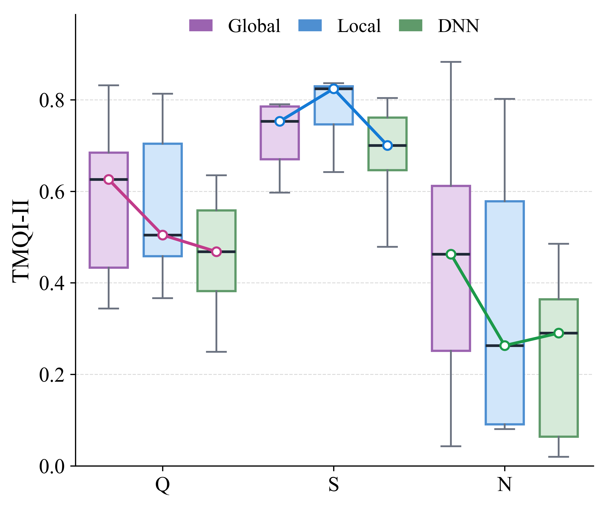
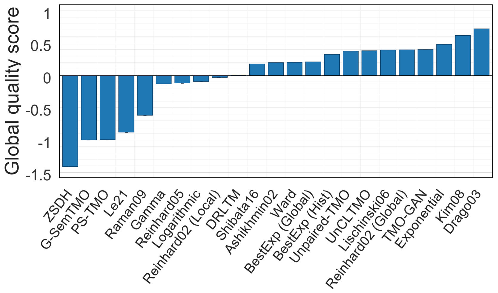

# 🌈 HDR Tone Mapping: From Data Acquisition to Visual Quality Evaluation

Survey resources, MATLAB experiment results, and a reference Python
implementation for:

> **A Comprehensive Survey on High Dynamic Range Tone Mapping: From Acquisition to Evaluation**  
> Jiebin Yan, Qiulin Zeng, Yaohua Zha, Ming Yu, Xiaolv Xu, Xuelin Liu, and Yuming Fang

This repository connects the full HDR imaging pipeline described in the survey
with the MATLAB code used to generate the traditional TMO results, synchronized
objective metric results, and a runnable Python port of the HDR Toolbox.

> ⚠️ **Important implementation note:** The tone-mapped images and quantitative
> results reported in the manuscript were generated with the MATLAB
> implementations and the original deep-learning repositories. The Python port
> in `hdrtmo/` is provided for reference and convenient experimentation. It is
> not numerically identical to the MATLAB implementation, and its output may
> differ because of implementation details, default parameters, image I/O,
> interpolation, color conversion, and floating-point behavior. Do not use the
> Python output as a drop-in replacement when reproducing the paper tables.

## 🌄 Overview

HDR tone mapping compresses scene luminance into the range of a target display
while attempting to preserve structure, local visibility, natural brightness,
and color appearance. The survey treats tone mapping as one stage of a complete
signal chain rather than an isolated image transform:

<p align="center">
  
</p>

<p align="center"><em>
HDR imaging pipeline from scene acquisition and transfer decoding to tone
mapping and HDR/LDR display adaptation.
</em></p>

The main message is practical: input encoding, luminance scale, color primaries,
and display assumptions must be handled consistently before TMO performance can
be compared fairly.

## 📦 Repository Contents

| Path | Description |
| --- | --- |
| `hdrtmo/` | Python HDR processing and tone-mapping package |
| `HDR_Toolbox-master/` | Original MATLAB HDR Toolbox source used as the migration reference |
| `metrics/` | Objective results for the survey test set and metric scripts |
| `configs/` | Reader presets for PQ and linear HDR inputs |
| `tools/` | Migration inventory and 31-TMO validation utilities |
| `tests/` | Unit and integration tests |
| `docs/` | Migration notes, operator audit, and input/output conventions |
| `hdrimage/` | Small HDR samples for local testing |

The reference Python CLI exposes all 31 single-image tone-mapping operators
migrated from `HDR_Toolbox-master/source_code/Tmo`.

## 🗂️ HDR Dataset Summary

The datasets reviewed in the survey differ substantially in acquisition,
encoding, scale, and intended use. `FFmpeg` in this table denotes the
linear-scaled storage convention identified in the manuscript, not an HDR
transfer-function standard.

| Dataset | Year | Images | Encoding | Resolution | Public access |
| --- | ---: | ---: | --- | --- | --- |
| HDR-gallery | 2007 | 8 | FFmpeg | Various | [Link](https://pfstools.sourceforge.net/hdr_gallery.html) |
| HDRPS | 2007 | 106 | FFmpeg | Various | [Link](http://markfairchild.org/HDR.html) |
| Funt | 2010 | 105 | FFmpeg | 1422 x 2142 | [Link](https://www.cs.sfu.ca/~colour/data/funt_hdr/) |
| MIT-Adobe FiveK | 2011 | 5,000 | RAW | Various | [Link](https://data.csail.mit.edu/graphics/fivek/) |
| Narwaria | 2013 | 10 | Linear | 1080 x 1920 | [Link](https://www.repository.cam.ac.uk/items) |
| Korshunov | 2015 | 20 | Linear | 1080 x 944 | [Link](https://www.repository.cam.ac.uk/items) |
| HDR-Eye | 2015 | 46 | Linear | 1080 x 1920 | [Link](https://www.epfl.ch/labs/mmspg/downloads/hdr-eye/) |
| SJTU-HDR | 2016 | 16 | PQ | 2160 x 3840 | [Link](https://medialab.sjtu.edu.cn/files) |
| LVZ | 2021 | 457 | FFmpeg | Various | [Link](https://www.kaggle.com/datasets/landrykezebou/lvzhdr-tone-mapping-benchmark-dataset-tmonet) |
| HDRC | 2024 | 80 | FFmpeg | 1080 x 1920 | [Link](https://github.com/Yliu724/HDRC) |
| HDRQAD | 2025 | 147 | FFmpeg | 1080 x 944 | [Link](https://github.com/SHU-HDRQAD/HDR-IQA-Dataset) |
| HDRT | 2025 | 10,000 | Linear | 5120 x 3840 | [Link](https://huggingface.co/datasets/jingchao-peng/HDRTDataset) |

<table>
  <tr>
    <td width="25%" align="center"></td>
    <td width="25%" align="center"></td>
    <td width="25%" align="center"></td>
    <td width="25%" align="center"></td>
  </tr>
</table>

<p align="center"><em>
Representative scenes from the 1,000-image survey dataset. Native PQ content
is gamma-corrected here for visualization on conventional SDR displays.
</em></p>

## 🧭 TMO Method Taxonomy

The survey groups traditional methods by spatial behavior and learning-based
methods by model family.

| Method | Year | Category | Core mechanism |
| --- | ---: | --- | --- |
| Gamma | - | Global | Power-law nonlinear luminance scaling |
| Logarithmic | - | Global | Standard logarithmic dynamic-range compression |
| Exponential | - | Global | Exponential luminance mapping |
| BestExp | - | Global | Mean- or histogram-based exposure alignment |
| Ward | 1997 | Global | HVS visibility matching with log-luminance histogram adjustment |
| Ashikhmin02 | 2002 | Local | TVI contrast sensitivity with adaptive neighborhood selection |
| Reinhard02 | 2002 | Hybrid | Global photographic compression with local dodging and burning |
| Drago03 | 2003 | Global | Adaptive logarithmic luminance compression |
| Reinhard05 | 2005 | Global | Photoreceptor-inspired nonlinear response model |
| Lischinski06 | 2006 | Local | Spatially varying exposure through energy minimization |
| Kim08 | 2008 | Global | Sigmoid mapping with visual consistency constraints |
| Raman09 | 2009 | Local | Bilateral-filter-based multi-exposure fusion |
| Shan10 | 2010 | Local | Spatially varying linear-window tone mapping |
| Mai11 | 2011 | Global | Backward-compatible global tone-curve optimization |
| Shibata16 | 2016 | Local | Gradient-domain reconstruction with base-structure constraints |
| Abebe17 | 2017 | Global | Perceptual-lightness-based luminance remapping |
| Liang18 | 2018 | Local | Hybrid l1-l0 layer decomposition |
| Yang21 | 2021 | Local | Spatially adaptive multi-scale histogram synthesis |
| Unpaired-TMO | 2021 | Deep learning: GAN | Structure-preserving unpaired translation |
| DRLTM | 2021 | Deep learning: CNN | Laplacian-pyramid hierarchical learned mapping |
| Le21 | 2021 | Deep learning: CNN | Normalized Laplacian-pyramid learned mapping |
| TMO-GAN | 2023 | Deep learning: GAN | End-to-end RGB-domain adversarial mapping |
| Tariq23 | 2023 | Local | Perceptually adaptive spatially varying tone mapping |
| G-SemTMO | 2024 | Deep learning: GNN | Semantic-aware trainable graph modeling |
| UnCLTMO | 2024 | Deep learning: CNN | Unpaired contrastive representation learning |
| ZSDH | 2024 | Deep learning: diffusion | Zero-shot structure-preserving diffusion mapping |
| PS-TMO | 2025 | Deep learning: CNN | Laplacian pyramid with pseudo-exposure decomposition and fusion |

<table>
  <tr>
    <th width="25%">HDR visualization</th>
    <th width="25%">Global: Drago03</th>
    <th width="25%">Local: Reinhard02</th>
    <th width="25%">Deep: TMO-GAN</th>
  </tr>
  <tr>
    <td width="25%" align="center"></td>
    <td width="25%" align="center"></td>
    <td width="25%" align="center"></td>
    <td width="25%" align="center"></td>
  </tr>
</table>

<p align="center"><em>
Representative comparison on scene a3391. Traditional results were generated
in MATLAB; the learning-based result was generated with its original model
implementation. These are not outputs of the reference Python port.
</em></p>

## ⚙️ Installation

The following commands install the **reference Python port**, not the MATLAB
benchmark implementation used for the paper.

Python 3.10 or later is required.

```bash
git clone https://github.com/HDR-Research/HDR-TM.git
cd HDR-TM
python -m pip install -e .
```

List the available operators:

```bash
hdrtmo --list-algorithms
```

## 🚀 Quick Start

Process one linear HDR image:

```bash
hdrtmo hdrimage/507.exr output/507_reinhard.png \
  --algorithm ReinhardTMO \
  --transfer linear_times_100 \
  --input-primaries rec2020 \
  --working-primaries rec709 \
  --overwrite
```

Process a PQ-encoded PNG:

```bash
hdrtmo hdrimage/black_032.png output/black_drago.png \
  --algorithm DragoTMO \
  --transfer pq \
  --input-primaries rec2020 \
  --working-primaries rec709 \
  --overwrite
```

Run every migrated single-image TMO on a folder:

```bash
hdrtmo hdrimage output/all_tmos \
  --all \
  --transfer auto \
  --input-primaries rec2020 \
  --working-primaries rec709 \
  --auto-expose-gamma \
  --max-side 512 \
  --overwrite
```

See [`PYTHON_README.md`](PYTHON_README.md) for transfer functions, color
primaries, parameters, output modes, and batch-processing examples.

## 🔁 Input Conventions

The processing order is:

```text
stored values
-> transfer decoding and luminance scaling
-> linear RGB
-> input-primary to working-primary conversion
-> tone-mapping operator
-> gamut handling and display encoding
-> output image
```

Supported transfer choices:

| CLI option | Interpretation |
| --- | --- |
| `--transfer pq` | Decode SMPTE ST 2084/PQ to absolute luminance |
| `--transfer linear` | Values are already linear |
| `--transfer linear_times_100` | Stored value `1.0` represents `100 cd/m²` |
| `--transfer auto` | PQ for PNG; `linear_times_100` for EXR/HDR/PFM |

Do not apply a TMO directly to perceptually encoded PQ or HLG values. Decode to
a linear-light representation first, then compute luminance with coefficients
that match the source primaries.

<p align="center">
  
</p>

<p align="center"><em>
PQ uses absolute-luminance perceptual quantization, while HLG uses a
broadcast-oriented relative transfer characteristic.
</em></p>

## 📊 Survey Benchmark

The survey dataset contains 1,000 PQ-encoded HDR images at `800 x 600`:
600 training images and 400 test images. Objective evaluation uses TMQI,
TMQI-II, and NLPD. Higher is better for TMQI and TMQI-II; lower is better for
NLPD.

Traditional TMO images in this benchmark were generated in MATLAB. Deep
learning outputs were generated with their original model implementations,
using retrained models or published pretrained weights as described in the
manuscript. The synchronized metric pipeline then evaluated those generated
images. The table below is therefore a MATLAB/original-model benchmark and is
not produced by the Python port in this repository.

| Method | TMQI | S1 | N1 | TMQI-II | S2 | N2 | NLPD |
| --- | ---: | ---: | ---: | ---: | ---: | ---: | ---: |
| Gamma | 0.8200 | 0.8588 | 0.2083 | 0.4833 | 0.7544 | 0.2122 | 0.1473 |
| Logarithmic | 0.8516 | 0.7632 | 0.4962 | 0.3938 | 0.7667 | 0.0210 | 0.2046 |
| Exponential | 0.8937 | 0.8319 | 0.6085 | **0.8896** | 0.8356 | **0.9435** | 0.1670 |
| BestExp (Hist) | 0.8730 | 0.8481 | 0.4697 | 0.7395 | 0.8147 | 0.6643 | 0.1582 |
| BestExp (Mean) | 0.8563 | **0.8731** | 0.3516 | 0.5952 | 0.7932 | 0.3972 | 0.1477 |
| Ward | 0.8959 | 0.8134 | 0.6624 | 0.7291 | 0.8411 | 0.6171 | 0.1833 |
| Ashikhmin02 | 0.8659 | 0.7764 | 0.5506 | 0.4188 | 0.7987 | 0.0390 | 0.1980 |
| Drago03 | **0.9007** | 0.8055 | 0.6949 | 0.8196 | 0.8416 | 0.7975 | 0.1801 |
| Reinhard02 (Local) | 0.8758 | 0.7669 | 0.6207 | 0.7038 | 0.8444 | 0.5632 | 0.1841 |
| Reinhard02 (Global) | 0.8903 | 0.7860 | 0.6695 | 0.6710 | 0.8264 | 0.5157 | 0.1856 |
| Reinhard05 | 0.8298 | 0.8389 | 0.2741 | 0.4105 | 0.7655 | 0.0556 | 0.1798 |
| Lischinski06 | 0.8976 | 0.8076 | 0.6761 | 0.8259 | 0.8360 | 0.8159 | 0.1743 |
| Kim08 | 0.8737 | 0.7660 | 0.6113 | 0.4729 | 0.7970 | 0.1489 | 0.1985 |
| Raman09 | 0.8163 | 0.7825 | 0.2821 | 0.4206 | 0.7553 | 0.0859 | 0.2072 |
| Shibata16 | 0.8784 | 0.7900 | 0.5994 | 0.4843 | 0.8144 | 0.1541 | 0.1897 |
| DRLTM | 0.8826 | 0.7232 | **0.7372** | 0.4077 | 0.7859 | 0.0294 | 0.1975 |
| Le21 | 0.8291 | 0.8091 | 0.2824 | 0.4729 | 0.7370 | 0.2088 | 0.1539 |
| TMO-GAN | 0.8380 | 0.8446 | 0.3035 | 0.5646 | 0.8168 | 0.3123 | 0.1552 |
| G-SemTMO | 0.7623 | 0.8070 | 0.0389 | 0.3340 | 0.6510 | 0.0171 | **0.1470** |
| UnCLTMO | 0.8732 | 0.8056 | 0.5367 | 0.5444 | 0.8142 | 0.2746 | 0.1781 |
| Unpaired-TMO | 0.8587 | 0.7786 | 0.5048 | 0.6450 | **0.8567** | 0.4333 | 0.1788 |
| ZSDH | 0.6823 | 0.5629 | 0.0215 | 0.2581 | 0.5161 | 0.0000 | 0.2214 |
| PS-TMO | 0.8695 | 0.8043 | 0.5069 | 0.4884 | 0.7198 | 0.2570 | 0.1647 |

The table follows the final survey manuscript. The synchronized machine-readable
results are in [`metrics/metric_results_last400`](metrics/metric_results_last400).
Most methods contain 400 valid image pairs; G-SemTMO contains 395, with five
missing outputs recorded in the report.

The results show that no single objective metric fully explains human
preference. Drago03 ranks first in the subjective study, while some methods with
strong NLPD values receive much lower JOD rankings. This motivates reporting
structure, naturalness, perceptual distance, and subjective quality together.

<p align="center">
  
</p>

<p align="center"><em>
TMQI-II quality, structural-fidelity, and naturalness distributions for global,
local, and deep-learning TMOs.
</em></p>

<p align="center">
  
</p>

<p align="center"><em>
Subjective JOD ranking from the 2AFC user study. Higher values indicate stronger
perceptual preference.
</em></p>

## ✅ Reproducing Checks

The checks below validate the reference Python translation. Passing them does
not imply pixel-wise parity with the MATLAB paper implementation.

Run the Python test suite:

```bash
python -m unittest discover -s tests
```

Run the compact 31-TMO validation:

```bash
python tools/test_all_tmos.py \
  --input hdrimage \
  --output tmo_test_results \
  --max-side 256
```

The current local validation covers 31 operators on three sample images and
passes all `93/93` combinations. This is a software smoke test, not a
reproduction of the manuscript benchmark.

Metric reproduction scripts and the expected server-side directory conventions
are documented in [`metrics/README.md`](metrics/README.md).

## 📝 Citation

The survey is currently distributed as a manuscript. Please update the venue,
year, volume, pages, and DOI after publication.

```bibtex
@article{yan_hdr_tone_mapping_survey,
  title   = {A Comprehensive Survey on High Dynamic Range Tone Mapping:
             From Acquisition to Evaluation},
  author  = {Yan, Jiebin and Zeng, Qiulin and Zha, Yaohua and Yu, Ming and
             Xu, Xiaolv and Liu, Xuelin and Fang, Yuming},
  note    = {Manuscript}
}
```

When using the translated toolbox implementation, also cite the original HDR
Toolbox and *Advanced High Dynamic Range Imaging (2nd Edition)*.

## 📄 License

The Python port is derived from the GPL-3.0-licensed HDR Toolbox and is
distributed under the GNU General Public License v3.0. See [`LICENSE`](LICENSE)
and the original notice in `HDR_Toolbox-master/license.txt`.

## 📬 Contact

- Qiulin Zeng: [qiulinzeng0722@163.com](mailto:qiulinzeng0722@163.com)
- Ming Yu: [yuming03133@163.com](mailto:yuming03133@163.com)
- Xiaolv Xu: [XuXiaoLv2003@163.com](mailto:XuXiaoLv2003@163.com)
