# 🌈 HDR Tone Mapping: From Data Acquisition to Visual Quality Evaluation

Survey resources, MATLAB experiment results, and a reference Python implementation for:

> **A Comprehensive Survey on High Dynamic Range Tone Mapping: From Acquisition to Evaluation**
> Jiebin Yan, Qiulin Zeng, Yaohua Zha, Ming Yu, Xiaolv Xu, Xuelin Liu, and Yuming Fang

This repository connects the full HDR imaging pipeline described in the survey with the MATLAB code used to generate the traditional TMO results, synchronized objective metric results, and a runnable Python port of the HDR Toolbox.

> ⚠️ 
>
> **Important implementation note:**
>
>  The tone-mapped images and quantitative
> results reported in the manuscript were generated with the MATLAB
> implementations and the original deep-learning repositories. The Python port
> in 
>
> `hdrtmo/`
>
>  is provided for reference and convenient experimentation. It is
> not numerically identical to the MATLAB implementation, and its output may
> differ because of implementation details, default parameters, image I/O,
> interpolation, color conversion, and floating-point behavior. Do not use the
> Python output as a drop-in replacement when reproducing the paper tables.

## 🌄 Overview

HDR tone mapping compresses scene luminance into the range of a target display while attempting to preserve structure, local visibility, natural brightness, and color appearance. The survey treats tone mapping as one stage of a complete signal chain rather than an isolated image transform:

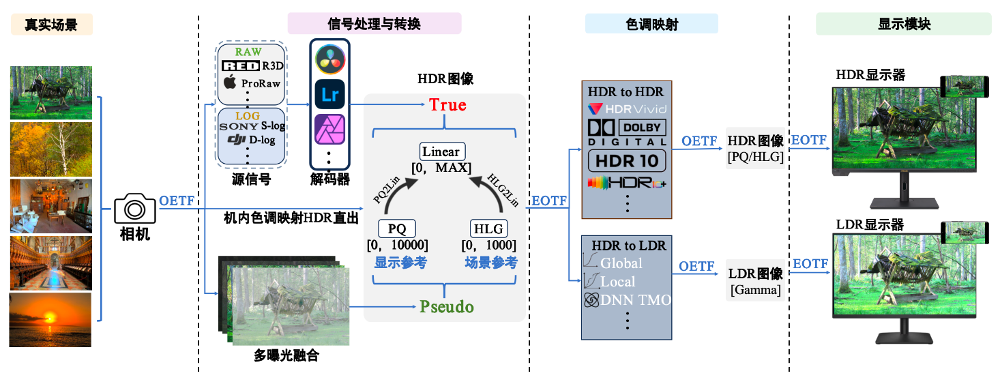

## 📦 Repository Contents

| Path                  | Description                                                        |
| --------------------- | ------------------------------------------------------------------ |
| `hdrtmo/`             | Python HDR processing and tone-mapping package                     |
| `HDR_Toolbox-master/` | Original MATLAB HDR Toolbox source used as the migration reference |
| `metrics/`            | Objective results for the survey test set and metric scripts       |
| `configs/`            | Reader presets for PQ and linear HDR inputs                        |
| `tools/`              | Migration inventory and 31-TMO validation utilities                |
| `tests/`              | Unit and integration tests                                         |
| `docs/`               | Migration notes, operator audit, and input/output conventions      |
| `hdrimage/`           | Small HDR samples for local testing                                |

The reference Python CLI exposes all 31 single-image tone-mapping operators migrated from `HDR_Toolbox-master/source_code/Tmo`.

## 🗂️ HDR Dataset Summary

The datasets reviewed in the survey differ substantially in acquisition, encoding, scale, and intended use. The table below follows the final manuscript (Table 4). `×1/100 linear scaling` denotes the FFmpeg-style convention in which scene-linear radiance is stored at 1/100 of its physical value; `Nonlinear` `storage` denotes perceptually encoded (PQ) storage.

| Dataset              | Year | Images | Acquisition / synthesis                                | Source | Encoding | Resolution  | Format       | Linear scaling        | Public access                                                                                      |
| -------------------- | ---- | ------ | ------------------------------------------------------ | ------ | -------- | ----------- | ------------ | --------------------- | -------------------------------------------------------------------------------------------------- |
| HDR-gallery\[46]     | 2007 | 8      | Multi-exposure compositing                             | —      | Linear   | 混合          | Radiance HDR | ×1/100 linear scaling | [Link](https://pfstools.sourceforge.net/hdr_gallery.html)                                          |
| HDRPS\[47]           | 2007 | 106    | Multi-exposure compositing                             | —      | Linear   | 混合          | Radiance HDR | ×1/100 linear scaling | [Link](http://markfairchild.org/HDR.html)                                                          |
| Funt\[48]            | 2010 | 105    | Multi-exposure compositing (Nikon D700)                | —      | Linear   | 1422 × 2142 | Radiance HDR | ×1/100 linear scaling | [Link](https://www.cs.sfu.ca/~colour/data/funt_hdr/)                                               |
| MIT-Adobe FiveK\[49] | 2011 | 5000   | —                                                      | RAW    | —        | 混合          | DNG/TIFF     | None                  | [Link](https://data.csail.mit.edu/graphics/fivek/)                                                 |
| Narwaria\[50]        | 2013 | 10     | Multi-exposure compositing                             | —      | Linear   | 1080 × 1920 | OpenEXR      | None                  | [Link](https://www.repository.cam.ac.uk/items)                                                     |
| Korshunov\[50]       | 2015 | 20     | —                                                      | —      | Linear   | 1080 × 944  | OpenEXR      | None                  | [Link](https://www.repository.cam.ac.uk/items)                                                     |
| HDR-Eye\[51]         | 2015 | 46     | —                                                      | —      | Linear   | 1080 × 1920 | Radiance HDR | None                  | [Link](https://www.epfl.ch/labs/mmspg/downloads/hdr-eye/)                                          |
| SJTU-HDR\[52]        | 2016 | 16     | HDR video capture (Sony F65/F55)                       | —      | PQ       | 2160 × 3840 | OpenEXR      | Nonlinear storage     | [Link](https://medialab.sjtu.edu.cn/files)                                                         |
| LVZ\[53]             | 2021 | 457    | —                                                      | —      | Linear   | 混合          | Radiance HDR | ×1/100 linear scaling | [Link](https://www.kaggle.com/datasets/landrykezebou/lvzhdr-tone-mapping-benchmark-dataset-tmonet) |
| HDRC\[54]            | 2024 | 80     | —                                                      | —      | Linear   | 1080 × 1920 | OpenEXR      | ×1/100 linear scaling | [Link](https://github.com/Yliu724/HDRC)                                                            |
| HDRQAD\[55]          | 2025 | 147    | —                                                      | —      | Linear   | 1080 × 944  | OpenEXR      | ×1/100 linear scaling | [Link](https://github.com/SHU-HDRQAD/HDR-IQA-Dataset)                                              |
| HDRT\[56]            | 2025 | 10,000 | RGB + infrared multimodal capture; Debevec compositing | —      | Linear   | 5120 × 3840 | Radiance HDR | None                  | [Link](https://huggingface.co/datasets/jingchao-peng/HDRTDataset)                                  |

| 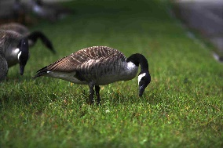 | 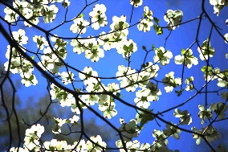 | 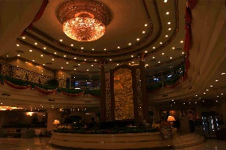 | 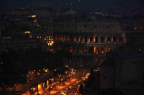 |   |
| ------------------------------------------------- | ------------------------------------------------- | ------------------------------------------------- | ------------------------------------------------- | -------------------------------------------------- |
| 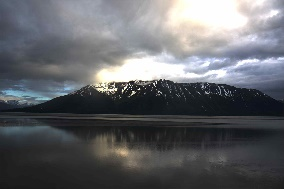 | 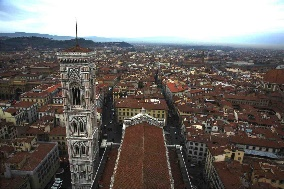 | 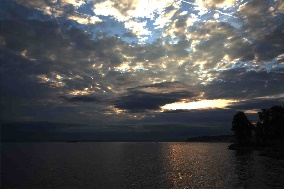 | 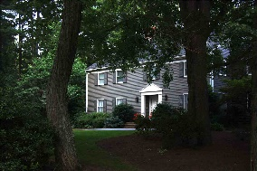 | 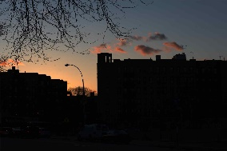 |

## 🧭 TMO Method Taxonomy

The survey groups traditional methods by spatial behavior and learning-based methods by model family. The table follows the final manuscript (Table 5).

| Method            | Year | Category  | Core mechanism                                                                                                                |
| ----------------- | ---- | --------- | ----------------------------------------------------------------------------------------------------------------------------- |
| Gamma             | -    | Global    | Power-law global luminance compression with fixed or tunable exponent                                                         |
| Logarithmic       | -    | Global    | Logarithmic global compression, usually normalized by peak luminance                                                          |
| Exponential       | -    | Global    | Exponential global mapping, strong highlight compression but limited shadow lifting                                           |
| BestExp           | -    | Global    | Linear scaling to match mean-luminance or histogram exposure without changing the dynamic-range structure                     |
| Ward\[4]          | 1997 | Global    | Global histogram adjustment based on the HVS contrast-sensitivity function, preserving visibility thresholds                  |
| Ashikhmin02\[61]  | 2002 | Local     | TVI-based contrast sensitivity with adaptive neighborhood selection                                                           |
| Drago03\[5]       | 2003 | Global    | Adaptive logarithmic global compression with parameters adjusted to the image luminance distribution                          |
| Reinhard02\[28]   | 2002 | Hybrid    | Photographic tone reproduction combining global compression with local dodging-and-burning                                    |
| Reinhard05\[6]    | 2005 | Global    | Photoreceptor-inspired global nonlinear mapping simulating human luminance adaptation                                         |
| Lischinski06\[62] | 2006 | Local     | Interactive local tonal adjustment via energy minimization                                                                    |
| Kim08\[7]         | 2008 | Global    | Sigmoid global mapping with visual-consistency constraints to preserve contrast and naturalness                               |
| Raman09\[63]      | 2009 | Local     | Bilateral-filter base/detail decomposition with multi-exposure fusion style local tone mapping                                |
| Shan10\[64]       | 2010 | Local     | Spatially varying linear-window mapping with per-pixel exposure adjustment                                                    |
| Mai11\[8]         | 2011 | Global    | Global tone-curve optimization (backward compatible)                                                                          |
| Shibata16\[65]    | 2016 | Local     | Gradient-domain reconstruction with base-structure constraints                                                                |
| Abebe17\[9]       | 2017 | Global    | Perceptual-lightness-based luminance remapping                                                                                |
| Liang18\[66]      | 2018 | Local     | Hybrid l1-l0 layer decomposition separating base and detail layers                                                            |
| Yang21\[67]       | 2021 | Local     | Spatially adaptive multi-scale histogram synthesis for local contrast                                                         |
| Tariq23\[68]      | 2023 | Local     | Perceptually adaptive spatially varying mapping, adjusting luminance and contrast per region                                  |
| Unpaired-TMO\[69] | 2021 | GAN       | Unpaired image translation with structure-preserving loss                                                                     |
| DRLTM\[70]        | 2021 | CNN       | Laplacian-pyramid hierarchical mapping: separate subnetworks process global low-frequency and local high-frequency components |
| Le21\[71]         | 2021 | CNN       | Normalized Laplacian-pyramid decomposition trained with the perceptual metric NLPD as loss                                    |
| TMO-GAN\[72]      | 2023 | GAN       | End-to-end GAN generating tone-mapped images directly in the RGB domain                                                       |
| G-SemTMO\[73]     | 2024 | CNN       | Region-wise block mapping guided by semantic segmentation                                                                     |
| UnCLTMO\[11]      | 2024 | CNN       | Unpaired contrastive representation learning                                                                                  |
| ZSDH\[74]         | 2024 | Diffusion | Zero-shot structure-preserving diffusion-based HDR tone mapping                                                               |
| PS-TMO\[10]       | 2025 | CNN       | Laplacian pyramid combined with pseudo-exposure decomposition and fusion                                                      |

<table>
  <tr>
    <td align="center"><br><b>(a) Gamma</b></td> <td align="center"><br><b>(b) BestExp(Hist)</b></td> <td align="center"><br><b>(c) BestExp(Mean)</b></td> <td align="center"><br><b>(d) Exponential</b></td> <td align="center"><br><b>(e) Drago03[5]</b></td>
  </tr>
  <tr>
    <td align="center"><br><b>(f) Ashikhmin02[61]</b></td> <td align="center"><br><b>(g) Kim08[7]</b></td> <td align="center"><br><b>(h) Lischinski06[62]</b></td> <td align="center"><br><b>(i) Logarithmic</b></td> <td align="center"><br><b>(j) Raman09[63]</b></td>
  </tr>
  <tr>
    <td align="center"><br><b>(k) Reinhard02(Global)[28]</b></td> <td align="center"><br><b>(l) Reinhard02(Local)[28]</b></td> <td align="center"><br><b>(m) Reinhard05[6]</b></td> <td align="center"><br><b>(n) Shibata16[65]</b></td> <td align="center"><br><b>(o) Ward[4]</b></td>
  </tr>
  <tr>
    <td align="center"><br><b>(p) G-SemTMO[73]</b></td> <td align="center"><br><b>(q) DRLTM[70]</b></td> <td align="center"><br><b>(r) TMO-GAN[72]</b></td> <td align="center"><br><b>(s) Unpaired-TMO[69]</b></td> <td align="center"><br><b>(t) Le21[71]</b></td>
  </tr>
  <tr>
    <td></td> <td align="center"><br><b>(u) ZSDH[74]</b></td> <td align="center"><br><b>(v) UnCLTMO[11]</b></td> <td align="center"><br><b>(w) PS-TMO[10]</b></td> <td></td>
  </tr>
</table>

## ⚙️ Installation

The following commands install the **reference Python port**, not the MATLAB benchmark implementation used for the paper.

Python 3.10 or later is required.

```
git clone https://github.com/HDR-Research/HDR-TM.git

cd HDR-TM

python -m pip install -e .
```

List the available operators:

```
hdrtmo --list-algorithms
```

## 🚀 Quick Start

Process one linear HDR image:

```
hdrtmo hdrimage/507.exr output/507\_reinhard.png \\

  \--algorithm ReinhardTMO \\

  \--transfer linear\_times\_100 \\

  \--input-primaries rec2020 \\

  \--working-primaries rec709 \\

  \--overwrite
```

Process a PQ-encoded PNG:

```
hdrtmo hdrimage/black\_032.png output/black\_drago.png \\

  \--algorithm DragoTMO \\

  \--transfer pq \\

  \--input-primaries rec2020 \\

  \--working-primaries rec709 \\

  \--overwrite
```

Run every migrated single-image TMO on a folder:

```
hdrtmo hdrimage output/all\_tmos \\

  \--all \\

  \--transfer auto \\

  \--input-primaries rec2020 \\

  \--working-primaries rec709 \\

  \--auto-expose-gamma \\

  \--max-side 512 \\

  \--overwrite
```

See [PYTHON\_README.md](PYTHON_README.md) for transfer functions, color primaries, parameters, output modes, and batch-processing examples.

## 🔁 Input Conventions

The processing order is:

```
stored values

-> transfer decoding and luminance scaling

-> linear RGB

-> input-primary to working-primary conversion

-> tone-mapping operator

-> gamut handling and display encoding

-> output image
```

Supported transfer choices:

| CLI option                    | Interpretation                                 |
| ----------------------------- | ---------------------------------------------- |
| `--transfer pq`               | Decode SMPTE ST 2084/PQ to absolute luminance  |
| `--transfer linear`           | Values are already linear                      |
| `--transfer linear_times_100` | Stored value `1.0` represents `100 cd/m²`      |
| `--transfer auto`             | PQ for PNG; `linear_times_100` for EXR/HDR/PFM |

Do not apply a TMO directly to perceptually encoded PQ or HLG values. Decode to a linear-light representation first, then compute luminance with coefficients that match the source primaries.

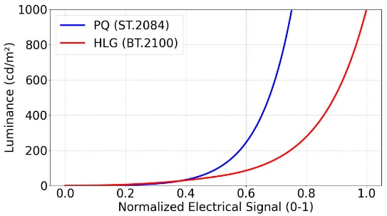

## 📊 Survey Benchmark

The survey dataset contains 1,000 HDR images: 600 training images and 400 test images. Objective evaluation uses TMQI, TMQI-II, NLPD, BTMQI, HIGRADE, and FFTMI. Higher is better for TMQI, TMQI-II, HIGRADE, and FFTMI; lower is better for NLPD and BTMQI.

Traditional TMO images in this benchmark were generated in MATLAB. Deep learning outputs were generated with their original model implementations, using retrained models or published pretrained weights as described in the manuscript. The synchronized metric pipeline then evaluated those generated images. The tables below are therefore a MATLAB/original-model benchmark and are not produced by the Python port in this repository.

| Method                  | TMQI       |            |            | TMQI-II    |            |            | NLPD↓      | BTMQI↓     | HIGRADE↑   | FFTMI↑     |
| ----------------------- | ---------- | ---------- | ---------- | ---------- | ---------- | ---------- | ---------- | ---------- | ---------- | ---------- |
|                         | Q1↑        | S1↑        | N1↑        | Q2↑        | S2↑        | N2↑        |            |            |            |            |
| Gamma                   | 0.8204     | 0.8593     | 0.2089     | 0.4876     | 0.7595     | 0.2157     | 0.4669     | 5.4049     | 0.1850     | 1.2003     |
| Logarithmic             | 0.8484     | 0.7627     | 0.4811     | 0.3942     | 0.7676     | 0.0208     | 0.5077     | 4.4919     | 0.0720     | 1.1683     |
| Exponential             | 0.8941     | 0.8324     | 0.6110     | **0.8908** | 0.8365     | **0.9452** | 0.4679     | 3.8084     | **0.3475** | 1.2396     |
| BestExp(Hist)           | 0.8738     | 0.8486     | 0.4735     | 0.7463     | 0.8198     | 0.6728     | 0.4609     | 4.1495     | 0.2995     | 1.2282     |
| BestExp(Mean)           | 0.8568     | **0.8736** | 0.3531     | 0.5992     | 0.7949     | 0.4034     | 0.4592     | 4.6653     | 0.2650     | 1.2274     |
| Ward\[4]                | 0.8955     | 0.8128     | 0.6615     | 0.7249     | 0.8414     | 0.6083     | 0.4686     | 3.6815     | 0.3195     | 1.2084     |
| Ashikhmin02\[61]        | 0.8630     | 0.7757     | 0.5373     | 0.4188     | 0.8003     | 0.0374     | 0.5033     | 4.1264     | 0.1419     | 1.1901     |
| Drago03\[5]             | **0.9001** | 0.8049     | 0.6943     | 0.8199     | 0.8424     | 0.7973     | 0.4757     | 3.6231     | 0.2850     | 1.2271     |
| Reinhard02(Local)\[28]  | 0.8717     | 0.7592     | 0.6181     | 0.6954     | 0.8451     | 0.5456     | 0.4791     | 4.0320     | 0.3173     | 1.2313     |
| Reinhard02(Global)\[28] | 0.8889     | 0.7855     | 0.6631     | 0.6615     | 0.8271     | 0.4958     | 0.4813     | 3.9581     | 0.3112     | 1.2102     |
| Reinhard05\[6]          | 0.8287     | 0.8384     | 0.2696     | 0.4110     | 0.7666     | 0.0554     | 0.4984     | 4.8078     | 0.1770     | 1.1855     |
| Lischinski06\[62]       | 0.8978     | 0.8082     | 0.6763     | 0.8244     | 0.8367     | 0.8122     | 0.4733     | 3.6672     | 0.3153     | **1.2438** |
| Kim08\[7]               | 0.8710     | 0.7643     | 0.6011     | 0.4710     | 0.7977     | 0.1442     | 0.4952     | 4.1326     | 0.0351     | 1.1453     |
| Raman09\[63]            | 0.8132     | 0.7830     | 0.2675     | 0.4210     | 0.7561     | 0.0858     | 0.5149     | 5.1604     | 0.1223     | 1.2347     |
| Shibata16\[65]          | 0.8773     | 0.7906     | 0.5921     | 0.4845     | 0.8149     | 0.1541     | 0.4939     | 3.8263     | 0.1582     | 1.2022     |
| DRLTM\[70]              | 0.8782     | 0.7173     | **0.7268** | 0.4065     | 0.7838     | 0.0293     | 0.5005     | **3.4859** | 0.0524     | 1.1869     |
| Le21\[71]               | 0.8305     | 0.8086     | 0.2902     | 0.4756     | 0.7350     | 0.2162     | **0.4443** | 3.8389     | 0.0417     | 1.1098     |
| TMO-GAN\[72]            | 0.8383     | 0.8447     | 0.3046     | 0.5664     | 0.8171     | 0.3156     | 0.4669     | 4.7242     | 0.2631     | 1.1821     |
| G-SemTMO\[73]           | 0.7631     | 0.8091     | 0.0393     | 0.3360     | 0.6544     | 0.0176     | 0.4637     | 6.5185     | -0.0930    | 1.0904     |
| UnCLTMO\[11]            | 0.8741     | 0.8056     | 0.5419     | 0.5441     | 0.8155     | 0.2727     | 0.4719     | 3.8877     | 0.1345     | 1.2337     |
| Unpaired-TMO\[69]       | 0.8598     | 0.7789     | 0.5101     | 0.6437     | **0.8556** | 0.4318     | 0.4612     | 3.9261     | 0.2487     | 1.2194     |
| ZSDH\[74]               | 0.6803     | 0.5583     | 0.0219     | 0.2580     | 0.5160     | 0.0000     | 0.5316     | 5.6180     | 0.0463     | 0.9701     |
| PS-TMO\[10]             | 0.8710     | 0.8039     | 0.5167     | 0.4892     | 0.7182     | 0.2601     | 0.4610     | 3.8794     | 0.0782     | 1.1064     |

The table follows the final survey manuscript (Table 6). Bold values are the best in each column. The synchronized machine-readable results are in [metrics/metric\_results\_last400](metrics/metric_results_last400). Most methods contain 400 valid image pairs; G-SemTMO contains 395, with five missing outputs recorded in the report.

The results show that no single objective metric fully explains human preference. Drago03 ranks first in the subjective study, while some methods with strong NLPD values receive much lower JOD rankings. This motivates reporting structure, naturalness, perceptual distance, and subjective quality together.

A 2AFC paired-comparison study (12 subjects, 15 HDR scenes, \~16,200 comparisons) was carried out with the ASAP sampling framework, and the pairwise responses were converted to global JOD scores via Thurstone maximum likelihood estimation. Table 7 compares the subjective JOD ranking with the rankings of the six objective metrics; ranking differences are defined as the JOD rank minus the corresponding objective-metric rank.

| Method                  | JOD     |      | TMQI |      | TMQI-II |      | NLPD |      | BTMQI |      | HIGRADE |      | FFTMI |      |
| ----------------------- | ------- | ---- | ---- | ---- | ------- | ---- | ---- | ---- | ----- | ---- | ------- | ---- | ----- | ---- |
|                         | Score   | Rank | Rank | Diff | Rank    | Diff | Rank | Diff | Rank  | Diff | Rank    | Diff | Rank  | Diff |
| Gamma                   | -0.1325 | 18   | 20   | -2   | 13      | +5   | 7    | +11  | 21    | -3   | 11      | +7   | 13    | +5   |
| Logarithmic             | -0.0969 | 16   | 16   | 0    | 21      | -5   | 21   | -5   | 16    | 0    | 18      | -2   | 18    | -2   |
| Exponential             | 0.4829  | 3    | 4    | -1   | 1       | +2   | 9    | -6   | 5     | -2   | 1       | +2   | 2     | +1   |
| BestExp(Hist)           | 0.3279  | 9    | 9    | 0    | 4       | +5   | 3    | +6   | 15    | -6   | 6       | +3   | 6     | +3   |
| BestExp(Mean)           | 0.2114  | 10   | 15   | -5   | 9       | +1   | 2    | +8   | 17    | -7   | 8       | +2   | 7     | +3   |
| Ward\[4]                | 0.2045  | 11   | 3    | +8   | 5       | +6   | 10   | +1   | 4     | +7   | 2       | +9   | 11    | 0    |
| Ashikhmin02\[61]        | 0.2018  | 12   | 13   | -1   | 18      | -6   | 20   | -8   | 13    | -1   | 14      | -2   | 14    | -2   |
| Drago03\[5]             | 0.7236  | 1    | 1    | 0    | 3       | -2   | 13   | -12  | 2     | -1   | 7       | -6   | 8     | -7   |
| Reinhard02(Local)\[28]  | -0.0317 | 15   | 10   | +5   | 6       | +9   | 14   | +1   | 12    | +3   | 3       | +12  | 5     | +10  |
| Reinhard02(Global)\[28] | 0.3971  | 5    | 5    | 0    | 7       | -2   | 15   | -10  | 11    | -6   | 5       | 0    | 10    | -5   |
| Reinhard05\[6]          | -0.1203 | 17   | 19   | -2   | 19      | -2   | 18   | -1   | 19    | -2   | 12      | +5   | 16    | +1   |
| Lischinski06\[62]       | 0.3952  | 6    | 2    | +4   | 2       | +4   | 12   | -6   | 3     | +3   | 4       | +2   | 1     | +5   |
| Kim08\[7]               | 0.6187  | 2    | 11   | -9   | 16      | -14  | 17   | -15  | 14    | -12  | 22      | -20  | 19    | -17  |
| Raman09\[63]            | -0.6184 | 19   | 21   | -2   | 17      | +2   | 22   | -3   | 20    | -1   | 16      | +3   | 3     | +16  |
| Shibata16\[65]          | 0.1801  | 13   | 7    | +6   | 14      | -1   | 16   | -3   | 6     | +7   | 13      | 0    | 12    | +1   |
| DRLTM\[70]              | 0.0046  | 14   | 6    | +8   | 20      | -6   | 19   | -5   | 1     | +13  | 19      | -5   | 15    | -1   |
| Le21\[71]               | -0.8817 | 20   | 18   | +2   | 15      | +5   | 1    | +19  | 7     | +13  | 21      | -1   | 20    | 0    |
| TMO-GAN\[72]            | 0.4010  | 4    | 17   | -13  | 10      | -6   | 7    | -3   | 18    | -14  | 9       | -5   | 17    | -13  |
| G-SemTMO\[73]           | -1.0018 | 22   | 22   | 0    | 22      | 0    | 6    | +16  | 23    | -1   | 23      | -1   | 22    | 0    |
| UnCLTMO\[11]            | 0.3838  | 7    | 8    | -1   | 11      | -4   | 11   | -4   | 9     | -2   | 15      | -8   | 4     | +3   |
| Unpaired-TMO\[69]       | 0.3753  | 8    | 14   | -6   | 8       | 0    | 5    | +3   | 10    | -2   | 10      | -2   | 9     | -1   |
| ZSDH\[74]               | -1.4123 | 23   | 23   | 0    | 23      | 0    | 23   | 0    | 22    | +1   | 20      | +3   | 23    | 0    |
| PS-TMO\[10]             | -0.9974 | 21   | 11   | +10  | 12      | +9   | 4    | +17  | 8     | +13  | 17      | +4   | 21    | 0    |

Table 8 summarizes the correlation and ranking error between each objective metric and the subjective JOD ranking. TMQI achieves the highest Spearman and Kendall correlations and the lowest ranking RMSE; NLPD shows almost no monotonic agreement with human preference.

| Objective metric | Spearman ρ↑ | Kendall τ-b↑ | Ranking RMSE↓ |
| ---------------- | ----------- | ------------ | ------------- |
| TMQI\[77]        | 0.6864      | 0.5386       | 5.2544        |
| TMQI-II\[78]     | 0.6759      | 0.4862       | 5.3406        |
| NLPD\[75]        | 0.0959      | 0.0634       | 8.9370        |
| BTMQI\[85]       | 0.4496      | 0.3439       | 6.9595        |
| HIGRADE\[86]     | 0.5464      | 0.4071       | 6.3177        |
| FFTMI\[84]       | 0.5168      | 0.4229       | 6.5209        |

| 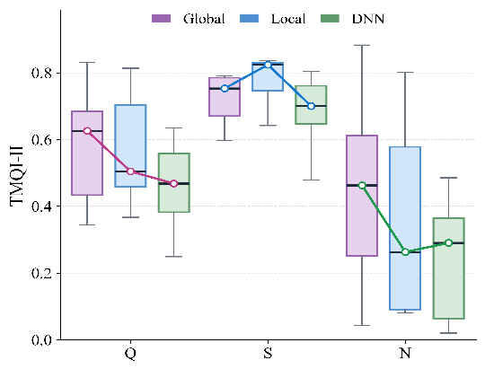 | 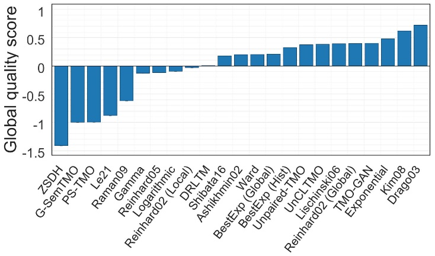 |
| --- | --- |

## ✅ Reproducing Checks

The checks below validate the reference Python translation. Passing them does not imply pixel-wise parity with the MATLAB paper implementation.

Run the Python test suite:

```
python -m unittest discover -s tests
```

Run the compact 31-TMO validation:

```
python tools/test\_all\_tmos.py \\

  \--input hdrimage \\

  \--output tmo\_test\_results \\

  \--max-side 256
```

The current local validation covers 31 operators on three sample images and passes all `93/93` combinations. This is a software smoke test, not a reproduction of the manuscript benchmark.

Metric reproduction scripts and the expected server-side directory conventions are documented in [metrics/README.md](metrics/README.md).

## 📝 Citation

The survey is currently distributed as a manuscript. Please update the venue, year, volume, pages, and DOI after publication.

```
@article{yan\_hdr\_tone\_mapping\_survey,

  title   = {A Comprehensive Survey on High Dynamic Range Tone Mapping:

             From Acquisition to Evaluation},

  author  = {Yan, Jiebin and Zeng, Qiulin and Zha, Yaohua and Yu, Ming and

             Xu, Xiaolv and Liu, Xuelin and Fang, Yuming},

  note    = {Manuscript}

}
```

When using the translated toolbox implementation, also cite the original HDR Toolbox and *Advanced High Dynamic Range Imaging (2nd Edition)*.

## 📄 License

The Python port is derived from the GPL-3.0-licensed HDR Toolbox and is distributed under the GNU General Public License v3.0. See [LICENSE](LICENSE) and the original notice in `HDR_Toolbox-master/license.txt`.

## 📬 Contact

* Qiulin Zeng: [qiulinzeng0722@163.com](mailto:qiulinzeng0722@163.com)

* Ming Yu: [yuming03133@163.com](mailto:yuming03133@163.com)

* Xiaolv Xu: [XuXiaoLv2003@163.com](mailto:XuXiaoLv2003@163.com)
